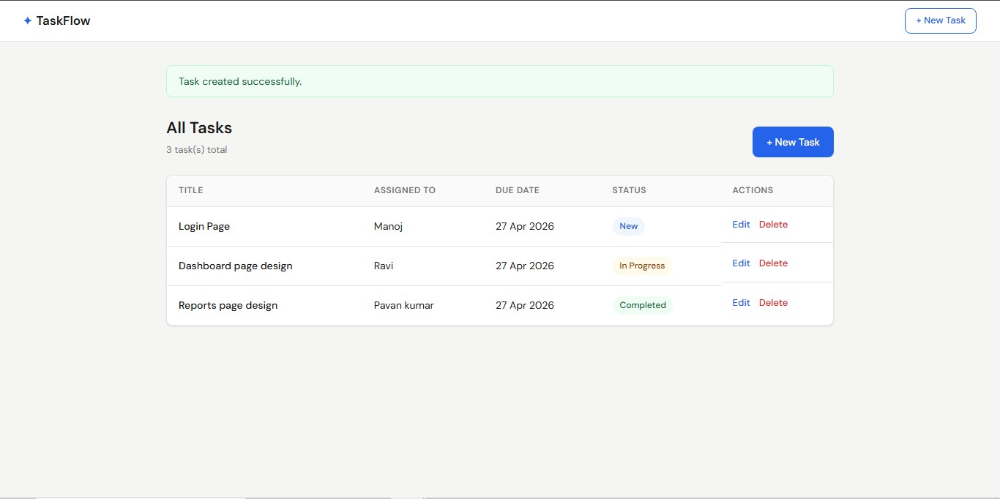
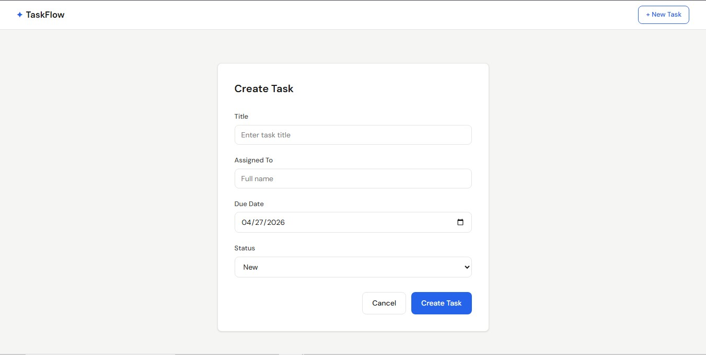
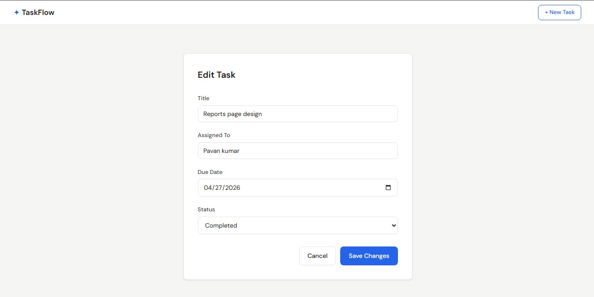
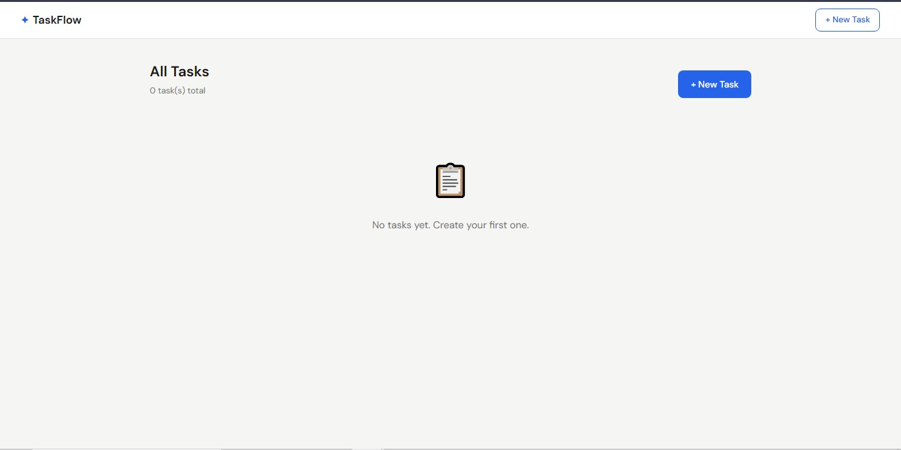

# Task Management Application

A simple task management web application built with ASP.NET Core 8 MVC.

## Tech Stack

- **Backend / UI:** ASP.NET Core 8 MVC
- **Data Storage:** In-memory (no database setup needed)
- **Unit Tests:** xUnit
- **UI Automation:** Playwright + NUnit

---

## Prerequisites

- [.NET 8 SDK](https://dotnet.microsoft.com/download/dotnet/8.0)
- Node.js (only needed to run Playwright install script)

---

## Running the Application

```bash
cd TaskManager.Web
dotnet run
```

The app will be available at `https://localhost:5001` (or the port shown in the terminal).

---

## Running Unit Tests

```bash
cd TaskManager.Tests
dotnet test
```

Expected: all tests in `InMemoryTaskServiceTests` and `TaskItemValidationTests` pass.

---

## Running Playwright UI Tests

Install browsers on first run:

```bash
cd TaskManager.Playwright
dotnet build
pwsh bin/Debug/net8.0/playwright.ps1 install
```

Make sure the application is running, then:

```bash
dotnet test
```

The default base URL in `TaskUITests.cs` is `https://localhost:5001`. Update it if your app runs on a different port.

---

## Project Structure

```
TaskManager/
├── TaskManager.Web/
│   ├── Controllers/         # TasksController, HomeController
│   ├── Models/              # TaskItem, TaskStatus, FutureDateAttribute
│   ├── Services/            # ITaskService, InMemoryTaskService
│   ├── Views/Tasks/         # Index, Create, Edit, Delete
│   └── wwwroot/css/         # site.css
├── TaskManager.Tests/
│   ├── InMemoryTaskServiceTests.cs
│   └── TaskItemValidationTests.cs
├── TaskManager.Playwright/
│   └── TaskUITests.cs
└── Manual_Test_Cases.docx
```

---

## Features

- Create a task (Title, Assigned To, Due Date, Status)
- View all tasks in a table
- Edit task details and update status
- Delete a task with confirmation
- Validation: required fields, future date enforcement, max length
- Flash messages on successful operations

## Screenshots

### Task List


### Create Task


### Edit Task


### Delete Task


### Task Flow

---

## Notes

- Data resets on application restart (in-memory storage).
- All business logic lives in `ITaskService` / `InMemoryTaskService` — decoupled from the controller.
- `FutureDateAttribute` is a custom `ValidationAttribute` — unit testable without any framework dependency.
